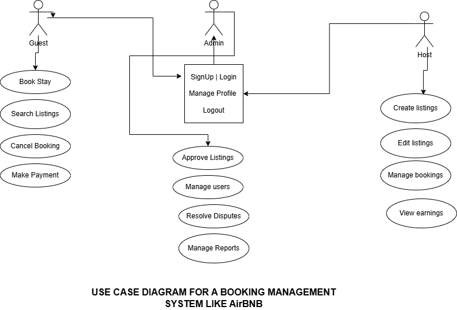

# Requirement Analysis in Software Development.
This repository explores the concept of Requirement Analysis in software development. It focuses on the importance of identifying, analyzing, and prioritizing software requirements before the development process begins. The goal is to understand how well-defined requirements help ensure successful project delivery, prevents scope creep, and improve communication among stakeholders. 

## What is Requirement Analysis?
Requirement Analysis is a critical phase in the software development lifecycle (SDLC) where the project team gathers, analyzes, and defines the requirements of the software product to be developed. It ensures that all stakeholders have a clear and mutual understanding of what the system should do and how it should perform.

## Why is Requirement Analysis Important?
1. **Clarity and Understanding:** It helps in understanding what the stakeholders expect from the software.
2. **Basis for Design and Development:** Provides a solid foundation for designing and developing the system.
3. **Scope Definition:** Clearly defines the scope of the project, which helps in preventing scope creep.
4. **Cost and Time Estimation:** Facilitates accurate estimation of project cost, resources, and time.

## Key Activities in Requirement Analysis.
1. **Requirement Gathering** 
  - Interviews: Conducting interviews with stakeholders to gather detailed information about their needs and expectations.
  - Surveys/Questionnaires: Distributing surveys to collect requirements from a larger audience.
  - Workshops: Organizing workshops with stakeholders to discuss and gather requirements.
  - Observation: Observing end-users in their working environment to understand their needs.
  - Document Analysis: Reviewing existing documentation and systems to understand current functionalities and requirements.
2. **Requirement Elicitation**
  - Brainstorming: Conducting brainstorming sessions to generate ideas and gather requirements.
  - Focus Groups: Holding focus group discussions with selected stakeholders to gather detailed requirements.
  - Prototyping: Creating prototypes to help stakeholders visualize the system and refine their requirements.
3. **Requirement Documentation**
  - Requirement Specification Document: Creating a detailed document that lists all functional and non-functional requirements.
  - User Stories: Writing user stories to describe functionalities from the user’s perspective.
  - Use Cases: Creating use case diagrams to show interactions between users and the system.
4. **Requirement Analysis and Modeling**
- Requirement Prioritization: Prioritizing requirements based on their importance and impact on the project.
- Feasibility Analysis: Assessing the feasibility of requirements in terms of technical, financial, and time constraints.
- Modeling: Creating models (e.g., data flow diagrams, entity-relationship diagrams) to visualize and analyze requirements.
5. **Requirement Validation**
- Review and Approval: Reviewing the documented requirements with stakeholders to ensure accuracy and completeness.
- Acceptance Criteria: Defining clear acceptance criteria for each requirement to ensure they meet the expected standards.
- Traceability: Establishing traceability matrices to ensure all requirements are addressed during development and testing.
## Types of Requirements.
###  Functional Requirements
This defines what a system should do i.e the specific features and functions it must have. Exampls are **User authentication, property search, booking system, user registration.**
**Examples of key functonal requirement in a booking management system**
- Users can search for available properties based on location, date, and number of guests.
- Guests can book a property and receive a booking confirmation.
- Hosts can list their properties, set availability, and manage pricing.
- Users can create accounts, log in, and manage their bookings.
### Non-functional Requirements
It describes how the system should perform. Examples are **Performance, security, scalability, usability, reliability.**
**Examples of key Non-functonal requirement in a booking management system**
- **Performance:** The website should load within 3 seconds even during peak hours. 
- **Scalability:** The system should support up to 10,000 concurrent users.
- **Security:** All personal and payment data must be securely encrypted.
- **Reliability:** System changes should not affect active bookings.
- **Compatibility:** The booking system should be usable on desktop and mobile browsers.

## Use Case Diagrams.
The objective of a Use Case Diagram is to show a visual representation of interactions between users and the system. This diagrams show how different users (actors) interact with the system to achieve specific goals (use cases).
### Benefits of Use case diagrams
- Provide a clear visual representation of system functionalities.
- Help in identifying and organizing system requirements.
- Facilitate communication among stakeholders and development team.

### Use Case Diagram for the Booking System

## Acceptance Criteria.
Acceptance criteria are conditions that a feature must meet to be accepted by the stakeholders — such as the client, product owner, or end-user. They act as a bridge between business requirements and technical implementation, ensuring clarity, alignment, and shared understanding among all team members.
### Importance of Acceptance Criteria
- To ensure all parties have a clear understanding of feature requirements.
- To provide a basis for testing and validation.
- To help in maintaining quality and meeting user expectations.
### Examples of Acceptance Criteria for Checkout Feature in a Booking Management System
#### 1. Valid Booking Summary Display
- The guest sees a summary of the selected property, including price breakdown, service fees, and total amount before payment.
#### 2. Payment Integration
- The guest can choose from multiple payment methods (e.g., credit/debit card, PayPal).
- Payment information must be securely transmitted and processed.
#### 3. Error Handling
- If payment fails, an error message is displayed.
- The guest remains on the checkout page without losing entered data.
#### 4. Confirmation Page
- After successful payment, the guest is redirected to a confirmation page.
- The page shows reservation details including booking ID, check-in/out dates, and host contact.
#### 5. Email Confirmation
- A confirmation email with booking details is sent to the guest's registered email.
#### 6. Date Availability Check
- The system verifies the selected dates are still available before confirming the booking.
#### 7. Authentication
- Only logged-in users can proceed to checkout.
